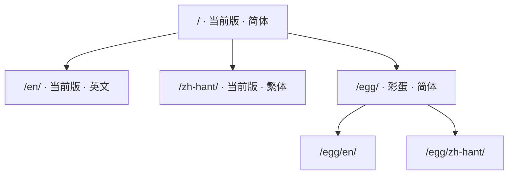

# 关于

这是一份 RWR（小兵步枪）地图编辑器的中文手册：**面板上的每一项是干什么的、
有哪些模型能摆、按键怎么按、配置文件怎么填**。写它的人是做地图的，不是官方。

|  |  |
| --- | --- |
| 地编版本 | 0101 |
| 手册编辑日期 | 20260922 |
| 当前编辑者 | HamSter |
| 清单模板版本 | vao0822 |

## 这份手册覆盖什么

| 分区 | 讲什么 |
| --- | --- |
| [准备工作](../prepare/index.md) | 拿到地编之后怎么配置、怎么与 RWR 的文件夹同步、怎么打开自带的相机 mod |
| [功能介绍](../editor/index.md) | 主界面各工具逐项说明、交互按键、按 ID 找物件，以及 mapSettings、3rdParSettings、RefpM 三份配置 |
| [模型清单](../tables/index.md) | 五张清单、六百多个物件，带预览图与备注 |
| [文件下载](../download/index.md) | 最新版地编、历次版本的完整归档，以及配套模板，点一次即自动取回 |

## 网址是怎么排的

版本在前、语言在后，所以同一页在不同版本、不同语言下各有各的地址：

## 哪些地方还没查证

不是每一行都试过。这些地方在页面上明确标着，读的时候请当心：

| 标记 | 意思 |
| --- | --- |
| **待试** | 整页都还没逐项验证过，比如 mapSettings 那一页 |
| **未完成** | 只写到一半，或只有一句话提及 |
| 没试 / 不知道这是啥 | 那一行作者也没验证过，**照着填可以，别当成结论** |

「据说是这样」的说法也原样留着。**这份手册不替读者作判断。**

!!! quote "哪些话照直写，哪些话要点开"
    这些记录是写给做图的人看的：结论照直写，用词不做软化——「加载时崩溃」
    「无碰撞箱」「千万别把材质错误全部归类成是模板类 Mesh」都保持原话。
    润成书面语之后，读者反而判断不出它有多确定。

    没验证过的地方照旧标着「待试」「没试」，含义不变：表示还没人试过，
    不代表能用，也不代表不能用。

    作者本人的私房话与吐槽另算——它们不影响任何结论，摆在正文里却会让整页
    读起来不像说明书，所以收进**点一下才展开**的遮挡块。点开仍能看到原话，
    读者据此也判断得出作者当时有多确定。
