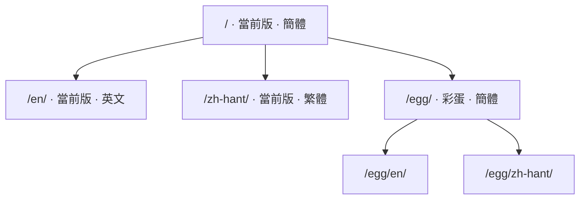

# 關於

這是一份 RWR（小兵步槍）地圖編輯器的中文手冊：**面板上的每一項是幹什麼的、
有哪些模型能擺、按鍵怎麼按、配置文件怎麼填**。寫它的人是做地圖的，不是官方。

|  |  |
| --- | --- |
| 地編版本 | 0101 |
| 手冊編輯日期 | 20260922 |
| 當前編輯者 | HamSter |
| 清單模板版本 | vao0822 |

## 這份手冊覆蓋什麼

| 分區 | 講什麼 |
| --- | --- |
| [準備工作](../prepare/index.md) | 拿到地編之後怎麼配置、怎麼與 RWR 的文件夾同步、怎麼打開自帶的相機 mod |
| [功能介紹](../editor/index.md) | 主界面各工具逐項說明、交互按鍵、按 ID 找物件，以及 mapSettings、3rdParSettings、RefpM 三份配置 |
| [模型清單](../tables/index.md) | 五張清單、六百多個物件，帶預覽圖與備註 |
| [文件下載](../download/index.md) | 最新版地編、歷次版本的完整歸檔，以及配套模板，點一次即自動取回 |

## 網址是怎麼排的

版本在前、語言在後，所以同一頁在不同版本、不同語言下各有各的地址：

## 哪些地方還沒查證

不是每一行都試過。這些地方在頁面上明確標着，讀的時候請當心：

| 標記 | 意思 |
| --- | --- |
| **待試** | 整頁都還沒逐項驗證過，比如 mapSettings 那一頁 |
| **未完成** | 只寫到一半，或只有一句話提及 |
| 沒試 / 不知道這是啥 | 那一行作者也沒驗證過，**照着填可以，別當成結論** |

「據說是這樣」的說法也原樣留着。**這份手冊不替讀者作判斷。**

!!! quote "哪些話照直寫，哪些話要點開"
    這些記錄是寫給做圖的人看的：結論照直寫，用詞不做軟化——「加載時崩潰」
    「無碰撞箱」「千萬別把材質錯誤全部歸類成是模板類 Mesh」都保持原話。
    潤成書面語之後，讀者反而判斷不出它有多確定。

    沒驗證過的地方照舊標着「待試」「沒試」，含義不變：表示還沒人試過，
    不代表能用，也不代表不能用。

    作者本人的私房話與吐槽另算——它們不影響任何結論，擺在正文裡卻會讓整頁
    讀起來不像說明書，所以收進**點一下才展開**的遮擋塊。點開仍能看到原話，
    讀者據此也判斷得出作者當時有多確定。
